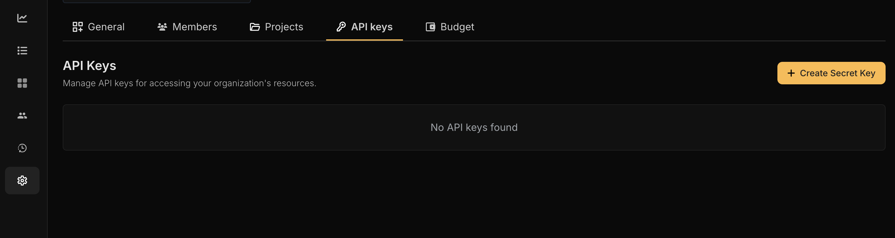

## Installation

Run the following command to install Netra in your environment

<CodeGroup>

```shellscript pip
pip install netra-sdk
```


```shellscript poetry
poetry add netra-sdk
```

</CodeGroup>

## Optional Dependencies

Netra SDK supports optional dependencies for enhanced functionality:

### Presidio for PII Detetcion

To use the PII detection features provided by Netra SDK:

<CodeGroup>

```shellscript pip
pip install 'netra-sdk[presidio]'
```


```shellscript poetry
poetry add netra-sdk --extras "presidio"
```

</CodeGroup>

<Warning>
  If you try to use the PII detection utility in Netra SDK without installing this dependency, you will receive an exception. So, always make sure to install the package if you plan to use this utility.
</Warning>

### LLM-Guard for Prompt Injection Protection

To use the full functionality of prompt injection scanning provided by llm-guard:

<CodeGroup>

```shellscript pip
pip install 'netra-sdk[llm_guard]'
```


```shellscript poetry
poetry add netra-sdk --extras "llm_guard"
```

</CodeGroup>

<Note>
  The `llm-guard` package has a dependency on PyTorch, which may cause installation issues on Intel Mac machines. The base SDK will install and function correctly without llm-guard, with limited prompt injection scanning capabilities. When `llm-guard` is not available, Netra will log appropriate warnings and continue to operate with fallback behavior.
</Note>

## Initialization

### API Key Configuration

To enable Netra SDK tracing, you need to provide an API key. You can obtain your API key from the Netra [dashboard](https://getnetra.ai/).



### Environment Variable Configuration

Add the following environment variables to your application to enable Netra SDK tracing.

```bash
export NETRA_OTLP_ENDPOINT="https://api.eu.getnetra.ai/telemetry"
export NETRA_API_KEY="your-api-key-here"
```

### Code Snippet

Follow the code below to initialize Netra in you application

<CodeGroup>

```python Python
from netra import Netra
from netra.instrumentation.instruments import InstrumentSet

# Initialize with default settings
Netra.init(app_name="Your application name")

# Or with custom configuration
api_key = "Your API key"
headers = f"x-api-key={api_key}"
Netra.init(
    app_name="Your application name",
    headers=headers,
    trace_content=True,
    environment="Your Application environment",
    instruments={InstrumentSet.OPENAI, InstrumentSet.ANTHROPIC},
)
```

</CodeGroup>

## Decorators for Easy Instrumentation

Netra SDK provides decorators like `@workflow`, `@agent`, and `@task` for easy instrumentation of your code. For more details and usage examples, please refer to the [Decorators](/tracing/decorators) section in our documentation.